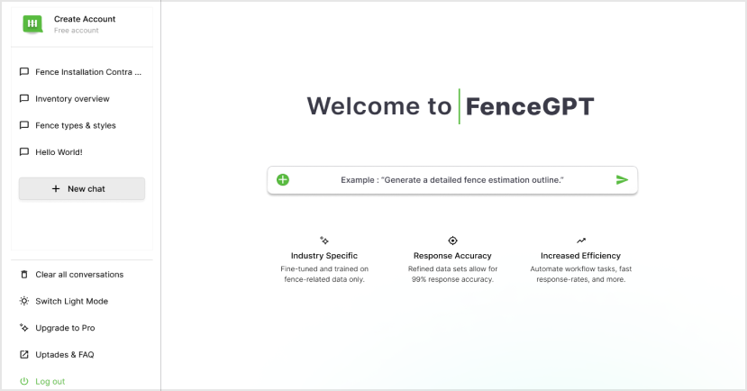

# Frontend Developer Interview Assessment

Welcome to the frontend developer interview assessment for Webify Services, Ltd. In this assessment, you will be tasked with implementing a single-page UI based on a provided Figma design. This task will help us evaluate your proficiency with our main frontend stack: TypeScript, React, and ChakraUI.

## Task Description

You will create a frontend implementation of the given UI design. The goal is to closely match the design while adhering to our specified coding standards and best practices. Below, you will find detailed instructions and the criteria on which your implementation will be assessed.

### Requirements

1. **Frameworks and Libraries**:
   - Use TypeScript, React, and ChakraUI.
   
2. **Project Setup**:
   - Fork this repository or create a branch.
   - Create a new project from scratch.
   - Ensure the project structure is clean and modular.
   
3. **UI Implementation**:
   - Match the provided Figma design as closely as possible.
   - Use ChakraUI components for all UI elements.
   - Styling must be done inline using ChakraUI's styling system (no external CSS or SCSS files).

4. **Code Quality**:
   - Implement the UI in a modular fashion, creating custom components for small pieces of the UI and combining them for the full implementation.
   - Follow SOLID principles, particularly the single responsibility principle.
   - Follow the DRY (Don't Repeat Yourself) principle to avoid code duplication.
   - Write scalable, extensible, and reusable code that is easy to understand.

5. **Responsiveness**:
   - Ensure the UI is responsive and works on both desktop and mobile screen sizes.
   - Focus primarily on desktop design but achieving mobile responsiveness is a stretch goal.

### Provided Materials & References

- Reference UI Design: Included in this repository: [`UI_Reference.png`](./UI_Reference.png)
- [Chakra UI Installation](https://v2.chakra-ui.com/getting-started)
- [Chakra UI Styled System](https://v2.chakra-ui.com/docs/styled-system/style-props)
- [Chakra UI Components](https://v2.chakra-ui.com/docs/components)

### Additional Notes
- The design is a draft of a single page UI from one of the Web Apps we're currently working on
- We don't expect your implementation to be pixel-perfect, but we do expect it to be as close as possible to the design
- Any icons used in the design can be replaced with any similar icons from Chakra UI's icon library or React icons icon library

 
- There are 3 mistakes in the UI, you can see if you can find them yourself or reveal them here:

- Mistake 1: The "Create Account" button at the top indicates the user is not signed in, but the user is signed in based on the rest of the sidebar UI
- Mistake 2: The second set of sidebar buttons has inconsistent casing conventions. Choose one and stick to it
- Mistake 3: The last sidebar button (excluding logout) has a typo

### Assessment Criteria

Your implementation will be evaluated based on the following criteria:

- **Design Fidelity**: How closely the implemented UI matches the Figma design.
- **Use of ChakraUI**: Proper usage of ChakraUI components and styling system.
- **Code Quality**: Adherence to modularity, SOLID principles, and DRY principle.
- **Readability and Maintainability**: Clarity and organization of the code.
- **Responsiveness**: How well the UI adapts to different screen sizes (desktop and mobile).

### Checklist

- [ ] Forked the repository or created a branch.
- [ ] Set up the project from scratch using TypeScript, React, and ChakraUI.
- [ ] Implemented the UI to match the Figma design.
- [ ] Used ChakraUI components and inline styling.
- [ ] Ensured the code follows SOLID and DRY principles.
- [ ] Made the UI responsive for both desktop and mobile screens.

### Reflection (Optional)

Please use this section to explain and reflect on your implementation. You can discuss any challenges faced, design decisions made, and how you ensured adherence to the principles and criteria outlined.

---

### Submission

Please submit your codebase as a GitHub repository link (either to your forked version of the repository or your branch in this repository). Ensure that the repository is accessible and contains clear instructions on how to run the project.

We look forward to reviewing your implementation. Good luck!

---

If you have any questions regarding the assessment, please do not hesitate to contact us.

### Reference Image

